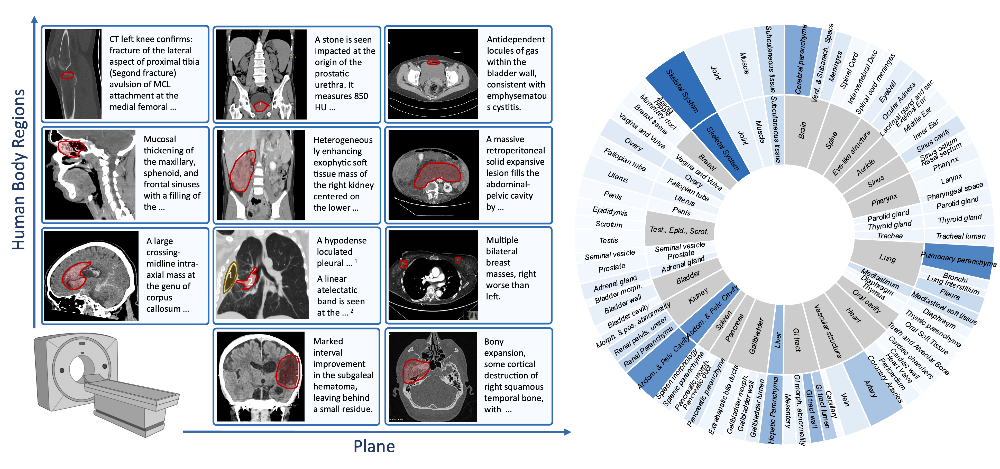

# OminiAbnorm-CT

This is the official repository for "Rethinking Whole-Body CT Image Interpretation: An Abnormality-Centric Approach".
**OminiAbnorm-CT** is developed for grounded abnormality analysis on CT images from multiple planes and all human body regions.

It is built on **OminiAbnorm-CT-14K**, first large-scale dataset designed for abnormality grounding and description on multi-plane whole-body CT imaging. 
It contains 14.5K CT images with grounding annotation for 19K abnormal findings.
Each abnormal findings is further linked to the detailed description in the report, and categorized according to a comprehensive hierarchical taxonomy.

🔍 Check our [paper](TODO) for more details.

## Data
Check [here](https://huggingface.co/datasets/zzh99/OminiAbnorm-CT) for the OminiAbnorm-CT-14K dataset and the taxonomy.

## Requirements
TBD

## Inference Guidance
TBD

## Traning Guidance
TBD

## Citation
TBD
